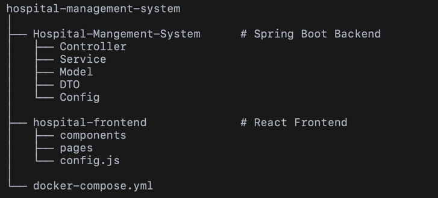

🏥 Hospital Management System

A full-stack Hospital Management System that helps hospitals manage patients, doctors, rooms, appointments, admissions, and billing through a modern web interface.

The system is built using Spring Boot (Backend) and React + Vite (Frontend) with PostgreSQL as the database and deployed using Render and Vercel.

⸻

🌐 Live Demo

Frontend

🔗 https://hospital-management-system-rust-zeta.vercel.app

Backend API

🔗 https://hospital-backend-xd5h.onrender.com

Example API Endpoint

🔗 https://hospital-backend-xd5h.onrender.com/api/patients

⸻

✨ Features

👨‍⚕️ Patient Management
•	Register new patients
•	View all patients
•	Admit patients to rooms
•	Discharge patients
•	Automatic billing generation

🩺 Doctor Management
•	Add doctors
•	View doctor list
•	Assign doctors to patients

🏥 Room Management
•	Add hospital rooms
•	View available rooms
•	Assign rooms during patient admission

📅 Appointment System
•	Book doctor appointments
•	Track appointments

💰 Billing System
•	Generate patient bill during discharge
•	Deduct patient deposit automatically

⸻

🏗️ System Architecture

React + Vite (Frontend)
│
▼
Spring Boot REST API (Backend)
│
▼
PostgreSQL Database (Neon Cloud)

Deployment

Frontend → Vercel
Backend → Render

⸻

⚙️ Tech Stack

Backend
•	Java 21
•	Spring Boot
•	Spring Data JPA
•	REST APIs
•	Maven
•	Docker

Frontend
•	React
•	Vite
•	Axios
•	Tailwind CSS

Database
•	PostgreSQL (Neon Cloud)

Deployment
•	Render (Backend)
•	Vercel (Frontend)

⸻

📁 Project Structure

⸻

🔗 API Endpoints

Patients

GET    /api/patients
POST   /api/patients
PUT    /api/patients/{patientId}/admit/{doctorId}/{roomId}
PUT    /api/patients/{patientId}/discharge

Doctors

GET    /api/doctors
POST   /api/doctors

Rooms

GET    /api/rooms
GET    /api/rooms/available
POST   /api/rooms

Appointments

POST   /api/appointments

⸻

🐳 Running Locally (Docker)

Clone Repository

git clone https://github.com/MADDY123987/hospital-management-system.git
cd hospital-management-system

Run with Docker

docker compose up --build

Backend will run at:

http://localhost:8085

⸻

💻 Running Without Docker

Backend

cd Hospital-Mangement-System
mvn spring-boot:run

Frontend

cd hospital-frontend
npm install
npm run dev

⸻

📊 Future Improvements
•	Authentication (Spring Security + JWT)
•	Role-based access (Admin / Doctor / Staff)
•	Payment gateway integration
•	Patient medical history tracking
•	Dashboard analytics

⸻
