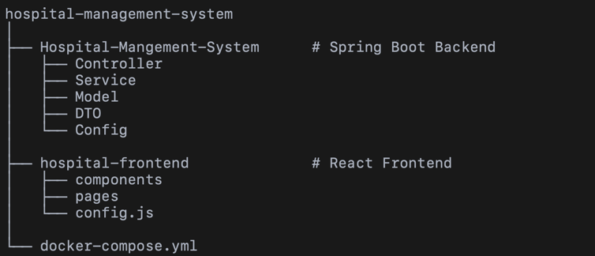

# 🏥 Hospital Management System

A full-stack Hospital Management System built using **Spring Boot**, **React (Vite)**, and **PostgreSQL**.

---

## 🌐 Live Demo

Frontend  
https://hospital-management-system-rust-zeta.vercel.app

Backend  
https://hospital-backend-xd5h.onrender.com

Example API  
https://hospital-backend-xd5h.onrender.com/api/patients

---

## ✨ Features

### Patient Management
- Register patients
- View all patients
- Admit patients
- Discharge patients with billing

### Doctor Management
- Add doctors
- View doctors

### Room Management
- Add rooms
- View available rooms
- Assign rooms to patients

### Appointment System
- Book appointments

---

## 🏗️ System Architecture

React + Vite (Frontend)

↓

Spring Boot REST API (Backend)

↓

PostgreSQL Database (Neon)

---

## ⚙️ Tech Stack

Backend
- Java 21
- Spring Boot
- Spring Data JPA
- Maven
- Docker

Frontend
- React
- Vite
- Axios
- Tailwind CSS

Database
- PostgreSQL (Neon)

Deployment
- Render (Backend)
- Vercel (Frontend)

---

## 📁 Project Structure

---

## 🔗 API Endpoints

### Patients
GET /api/patients  
POST /api/patients  
PUT /api/patients/{patientId}/admit/{doctorId}/{roomId}  
PUT /api/patients/{patientId}/discharge

### Doctors
GET /api/doctors  
POST /api/doctors

### Rooms
GET /api/rooms  
GET /api/rooms/available  
POST /api/rooms

### Appointments
POST /api/appointments

---
